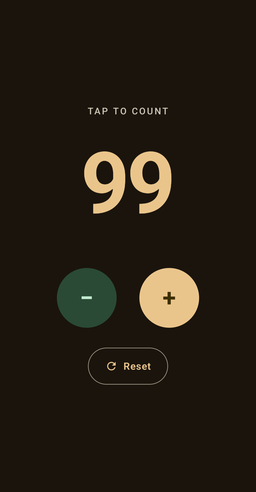

# Counter

A modern Android counter app built with **Jetpack Compose** and **Material 3**.

<p align="center">
  Increment · Decrement · Reset — with smooth animation, haptics, and a Goodreads-inspired theme.
</p>

## Screenshots

| At zero — controls disabled | Counting — active controls |
|:---:|:---:|
|  |  |

*The `−` and Reset controls dim and disable themselves at 0; the decrement button turns Goodreads-green once counting.*

## Features

- **Animated counter** — the number slides up on increment and down on decrement with a cross-fade (`AnimatedContent`).
- **State that survives config changes** — the count is held in `rememberSaveable`, so it persists across rotation.
- **Intentional floor at 0** — the counter never goes negative; the `−` and **Reset** controls disable and dim themselves at zero.
- **Haptic feedback** on every tap.
- **Goodreads-inspired Material 3 theme** — warm cream backgrounds, deep sepia-brown primary, and a green accent, with full light/dark support.
- **Large circular buttons** with proper touch targets, ripple, and tonal elevation; a pill-shaped reset button.

## Tech stack

| | |
|---|---|
| Language | Kotlin |
| UI | Jetpack Compose, Material 3 |
| Min SDK | 26 (Android 8.0) |
| Compile / Target SDK | 36 (Android 16) |
| Build | Gradle (Kotlin DSL), AGP 9 |

## Build & run

```bash
# Debug build
./gradlew assembleDebug

# Install to a connected device
./gradlew installDebug
adb shell am start -n com.example.counter/.MainActivity
```

### On-device setup
- Enable **Developer options → USB debugging**, then tap **Allow** on the USB debugging prompt.
- For tap feedback, enable **Touch / Haptic feedback** in the device's Sound & vibration settings.

## Release (signed) build

Signing credentials are read from a git-ignored `keystore.properties` at the project root:

```properties
storeFile=release-key.jks
storePassword=********
keyAlias=********
keyPassword=********
```

Generate a keystore and build:

```bash
keytool -genkeypair -v -keystore app/release-key.jks \
  -alias counter -keyalg RSA -keysize 2048 -validity 10000

./gradlew assembleRelease
# -> app/build/outputs/apk/release/app-release.apk
```

The release build enables R8 code shrinking and resource shrinking.

> The keystore (`*.jks`) and `keystore.properties` are excluded from version control. Back them up — Play Store updates must be signed with the same key.

## License

[MIT](LICENSE)
